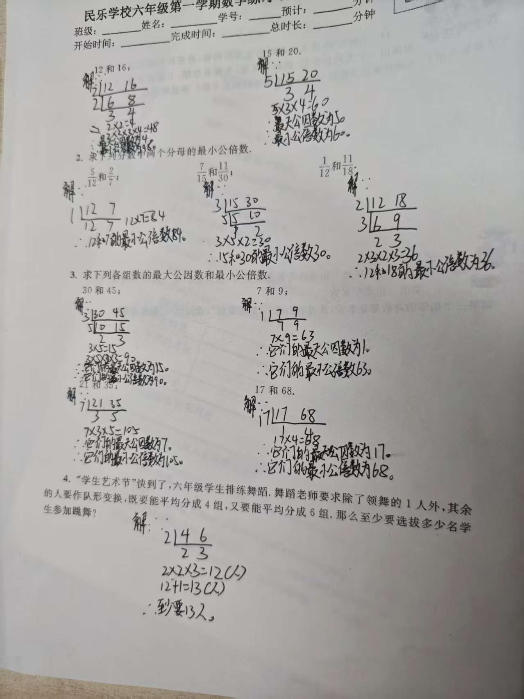
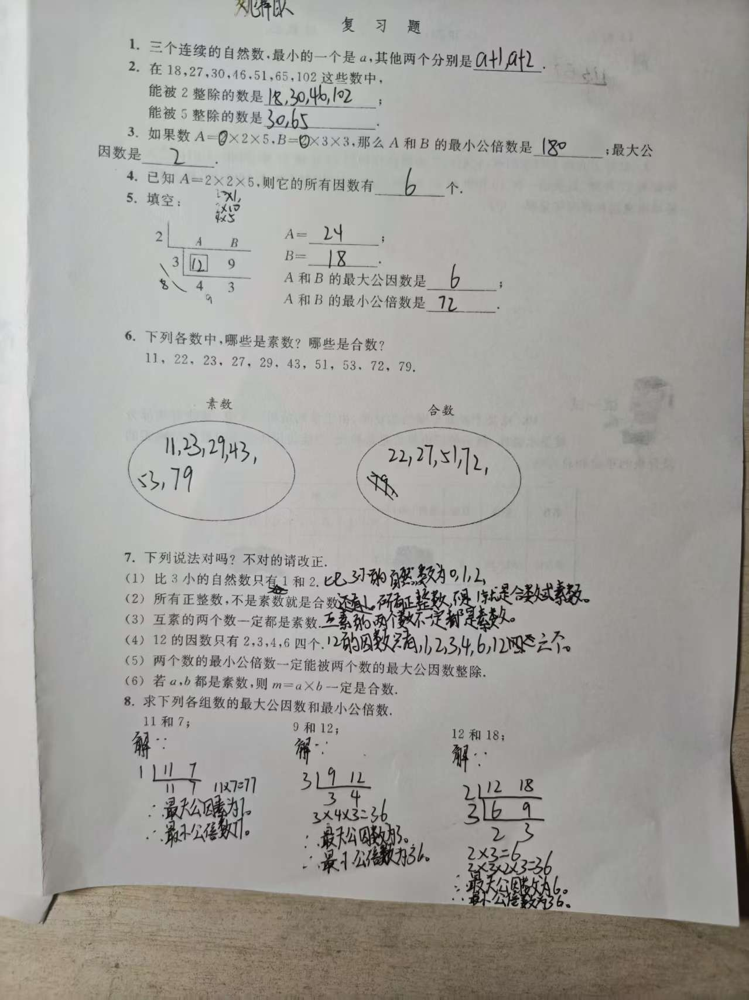

# 朵朵数学每日作业记录

记录日期：2026年9月14日  
记录对象：朵朵  
科目：数学

## 资料说明

本记录依据当天提供的两张作业照片整理。下文中的“核对结果”是根据照片中可辨认的最终答案进行的数学核对，不代表教师批改结论。首次作答与后来订正无法从照片中明确区分的地方，不作推断。

## 原始作业图片

### 最大公因数与最小公倍数练习

### 复习题

## 作业内容与核对结果

### 第一张：最大公因数与最小公倍数练习

| 题目内容 | 照片中可见答案 | 核对结果 |
| --- | --- | --- |
| 12和16的最大公因数、最小公倍数 | 4、48 | 正确 |
| 15和20的最大公因数、最小公倍数 | 5、60 | 正确 |
| 分母12和7的最小公倍数 | 84 | 正确 |
| 分母15和30的最小公倍数 | 30 | 正确 |
| 分母12和18的最小公倍数 | 36 | 正确 |
| 30和45的最大公因数、最小公倍数 | 15、90 | 正确 |
| 7和9的最大公因数、最小公倍数 | 1、63 | 正确 |
| 21和35的最大公因数、最小公倍数 | 7、105 | 正确 |
| 17和68的最大公因数、最小公倍数 | 17、68 | 正确 |
| 舞蹈分组应用题 | 至少13人 | 正确；除领舞1人外，其余12人可以平均分成4组或6组 |

### 第二张：复习题

| 题号 | 主要内容 | 照片中可见作答与核对结果 |
| --- | --- | --- |
| 1 | 用字母表示三个连续自然数 | 写出 `a＋1`、`a＋2`，正确 |
| 2 | 筛选2和5的倍数 | 2的倍数写为18、30、46、102；5的倍数写为30、65，均正确 |
| 3 | 根据分解式求最大公因数和最小公倍数 | 写出最大公因数2、最小公倍数180，正确 |
| 4 | 根据质因数分解判断因数个数 | 写出6个，正确 |
| 5 | 根据短除图反推原数，并求最大公因数和最小公倍数 | 写出甲数24、乙数18、最大公因数6、最小公倍数72，正确 |
| 6 | 区分素数与合数 | 最终分类正确；79附近有划改痕迹，无法仅凭照片判断首次作答内容 |
| 7 | 判断说法并改正错误说法 | 已完成判断和改写；部分笔迹重叠，本记录不推断首次判断顺序 |
| 8 | 求各组数的最大公因数和最小公倍数 | 11和7得到1、77；9和12得到3、36；12和18得到6、36，均正确 |

## 事实记录

- 两张作业照片中的题目主要涉及整除特征、素数与合数、因数个数、最大公因数、最小公倍数和分组应用题。
- 照片中可辨认的短除法、最大公因数和最小公倍数结果均正确。
- 两页作业的最终答案全部正确，没有错题。
- 第6题存在划改痕迹，但最终分类正确，因此不作为未订正错题记录。

## 父母观察与感受

- 父母观察：待填写。
- 当时感受：待填写。

## 后续记录

- [当天错题记录](../错题/2026-09-14.md)
- 订正是否独立完成：待填写。
- 后续同类题复查结果：待填写。
