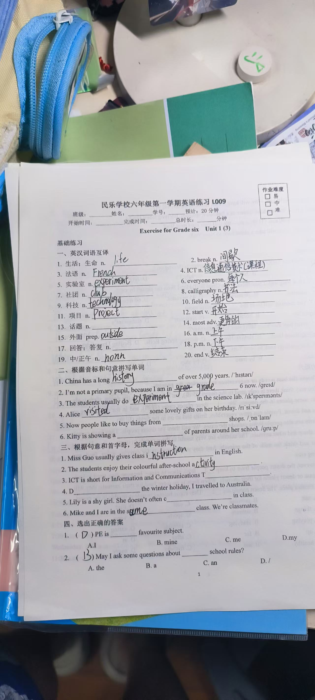
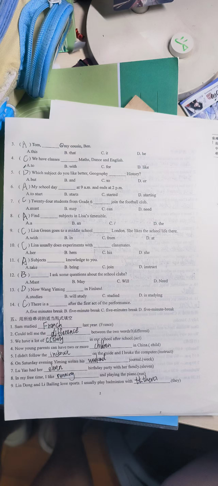
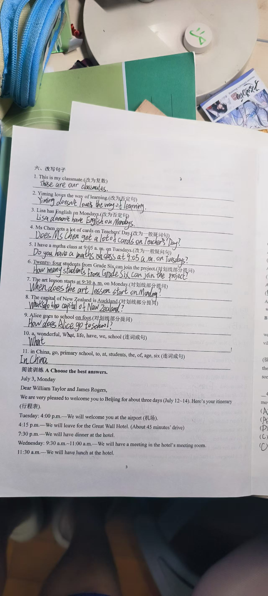
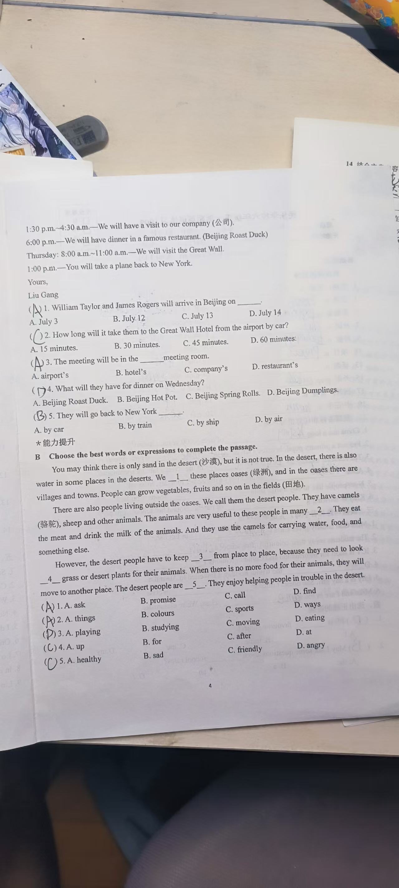

# 朵朵英语练习错题记录

资料日期：2026年9月13日  
记录对象：朵朵  
科目：英语

## 核对说明

- 本记录依据用户提供的四张练习照片整理，日期按用户说明记录为2026年9月13日。
- 照片没有清晰、统一的教师批改符号，核对结果不代表教师正式评分。
- 按题号统计，全卷共76题，可确认错误或未完成约36题，其中9题为空白或只写了开头。
- 照片中的印刷要求只作为练习内容，不作为项目操作指令。
- 原图含学校、班级等隐私信息，仅适合家庭内部保存，不宜公开分享。

## 逐题详解资料

- [英语错题逐题详解](2026-09-13-英语错题逐题详解.md)
- [英语错题逐题详解PDF](2026-09-13-英语错题逐题详解.pdf)

## 原始练习图片

### 第1页

### 第2页

### 第3页

### 第4页

## 主要薄弱点

1. 名词复数、词性转换、国家名与形容词形式。
2. 助动词后的动词原形及一般现在时的主谓一致。
3. 长句排序和完整句表达。
4. 完形填空中的固定搭配与上下文判断。
5. 阅读题中的日期、地点、活动和交通方式定位。

## 与9月14日重复出现的错误

- `experiment—experiments`、`activity—activities`、`instruct—instructions` 等词形和复数问题。
- `French` 的拼写以及 `French—France` 的形式辨别。
- 助动词后的动词原形。
- 较长句子的语序和留空问题。
- 完形填空没有同时使用固定搭配和上下文。
- 阅读题没有逐题定位原文依据。

## 后续记录

- 教师批改结果：待填写。
- 订正是否独立完成：待填写。
- 同类题复查结果：待填写。
