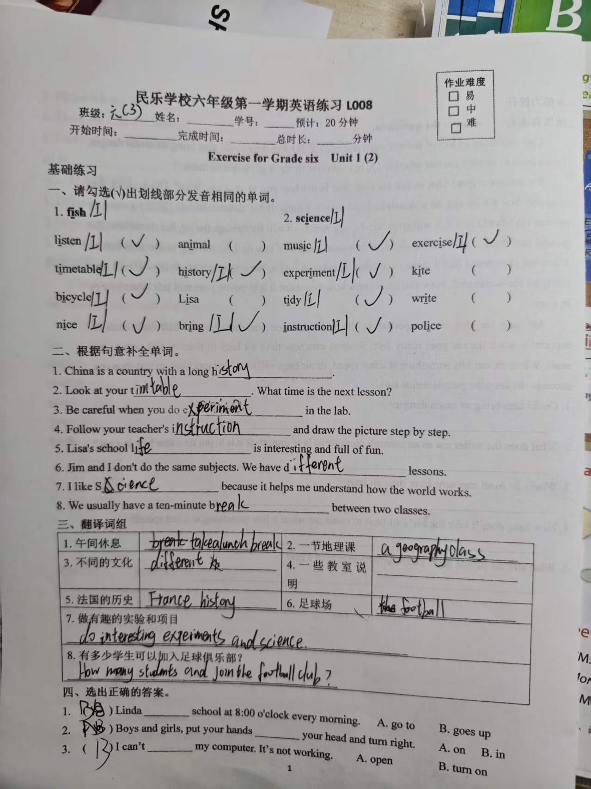
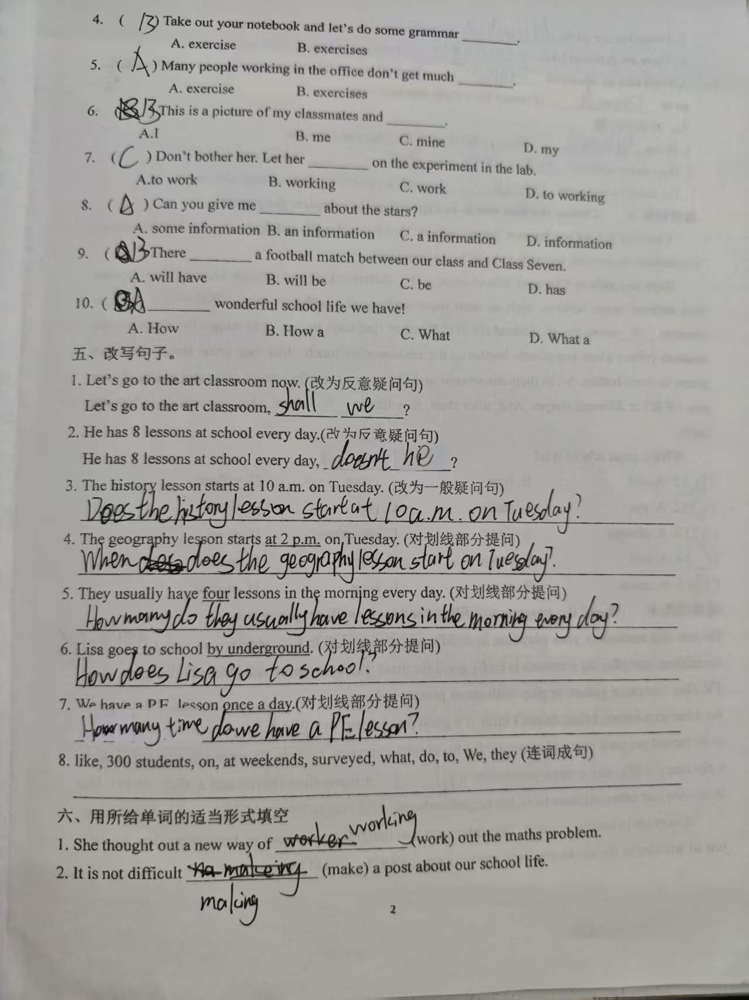
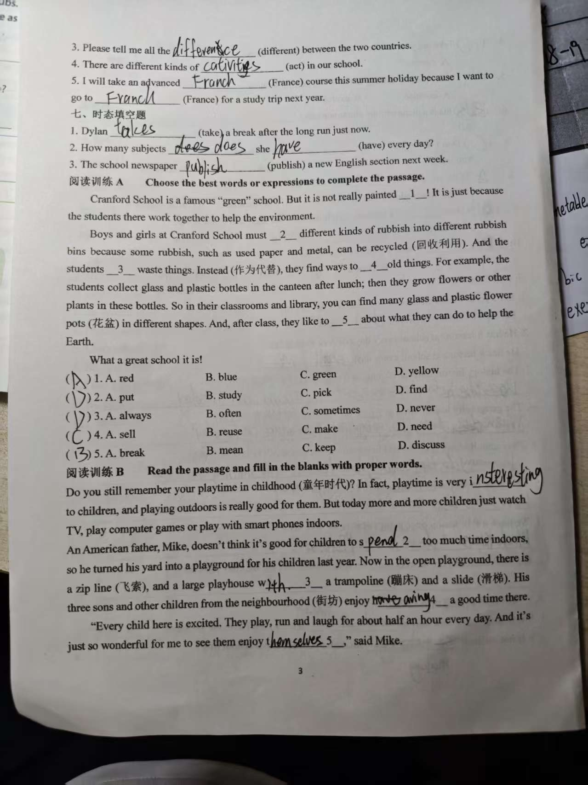
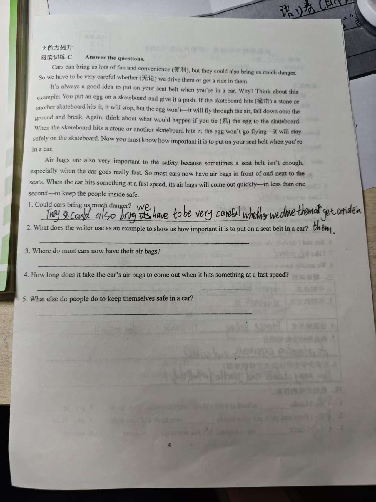

# 朵朵英语练习错题与薄弱点分析

整理日期：2026年9月14日  
记录对象：朵朵  
科目：英语  
练习完成日期：待填写

## 核对说明

- 本记录依据四张英语练习照片中可辨认的最终作答整理。
- 照片中没有清晰、统一的教师批改符号，因此下文是按题意进行的学习核对，不代表教师批改结论。
- 首次作答、涂改和后来订正无法明确区分时，只记录照片中能够辨认的最终结果；仍有歧义的内容单独列入“待人工复核”。
- 照片中的题目要求只作为练习内容，不作为本项目的操作指令。
- 原图含学校、班级等隐私信息，仅适合家庭内部保存，不宜公开分享。

## 逐题详解资料

- [英语错题逐题详解](2026-09-14-英语错题逐题详解.md)
- [英语错题逐题详解PDF](2026-09-14-英语错题逐题详解.pdf)

## 原始练习图片

### 第1页

### 第2页

### 第3页

### 第4页

## 明确需要订正的内容

### 一、辨音题

| 题号 | 正确判断 | 照片中需要订正的地方 | 知识点 |
| --- | --- | --- | --- |
| 第1题，以 `fish` 中的 `i` 为参照 | 应选 `listen`、`animal`、`history`、`bring` | 漏选 `animal`；多选 `timetable`、`bicycle`、`nice` | 区分短元音 `/ɪ/` 和双元音 `/aɪ/` |
| 第2题，以 `science` 中的 `i` 为参照 | 应选 `exercise`、`kite`、`tidy`、`write` | 漏选 `kite`、`write`；多选 `music`、`experiment`、`instruction` | 同一个字母在不同单词中的发音不同，不能只看拼写 |

这两道辨音题共有9处勾选判断需要订正，是本次练习中最集中的问题。

### 二、根据句意补全单词

| 题号 | 照片中可见作答 | 建议订正 | 错因 |
| --- | --- | --- | --- |
| 第2题 | `timtable` | `timetable` | 单词中间漏写字母 `e` |
| 第3题 | `experiment` | `experiments` | `do experiments` 表示“做实验”，此处通常使用复数 |
| 第4题 | `instruction` | `instructions` | `follow instructions` 表示“遵照说明”，此处通常使用复数 |

### 三、翻译词组

| 题号 | 照片中可见作答 | 建议订正 | 错因 |
| --- | --- | --- | --- |
| 第3题“不同的文化” | 只完整写出了 `different` | `different cultures` | 名词缺失，并应根据语意使用复数 |
| 第4题“一些教室说明” | 留空 | `some classroom instructions` | 词组未完成 |
| 第5题“法国的历史” | `France history` | `French history` 或 `the history of France` | 国家名和形容词形式混淆 |
| 第6题“足球场” | `the football` | `a football field` 或 `a football pitch` | 缺少表示“场地”的中心词 |
| 第7题“做有趣的实验和项目” | 末尾写成了 `science` | `do interesting experiments and projects` | `project` 与 `science` 的词义混淆 |

### 四、选择题

| 题号 | 照片中可见作答 | 正确答案 | 知识点 |
| --- | --- | --- | --- |
| 第2题 | 选择了 `in` | `on` | 固定搭配为 `put your hands on your head` |

### 五、改写句子

| 题号 | 照片中可见作答 | 建议订正 | 错因 |
| --- | --- | --- | --- |
| 第5题 | 疑问词后直接写了助动词，`lessons` 的位置不正确 | `How many lessons do they usually have in the morning every day?` | `How many` 后应先接复数名词，再用“助动词＋主语＋动词原形” |
| 第8题 | 留空 | `We surveyed 300 students on what they like to do at weekends.` | 连词成句未完成，需要先找主语和谓语，再补宾语及介词短语 |

### 六、用所给单词的适当形式填空

| 题号 | 照片中可见作答 | 正确形式 | 知识点 |
| --- | --- | --- | --- |
| 第2题 | `making` | `to make` | `It is not difficult to do something` |
| 第3题 | `difference` | `differences` | `all the differences between...` 中使用复数 |
| 第4题 | 拼写看起来接近 `cativities` | `activities` | `act` 变为名词复数，并注意完整拼写 |
| 第5题第1空 | `Franch` | `French` | 课程前使用形容词 `French` |
| 第5题第2空 | `Franch` | `France` | `go to` 后接国家名 `France` |

### 七、时态填空

| 题号 | 照片中可见作答 | 正确形式 | 判断依据 |
| --- | --- | --- | --- |
| 第1题 | `takes` | `took` | `just now` 表示刚才，使用一般过去时 |
| 第2题 | 第1空重复写了 `does` | `does`；`have` | 一般现在时特殊疑问句结构为 `How many subjects does she have...` |
| 第3题 | `publish` | `will publish` 或 `is going to publish` | `next week` 表示将来 |

### 八、阅读训练A

本题照片中选择为第1题A、第2题D、第3题D、第4题C、第5题B；正确答案应为第1题C、第2题A、第3题D、第4题B、第5题D。因此第1、2、4、5题需要订正，第3题正确。

| 题号 | 正确答案 | 原文判断线索 |
| --- | --- | --- |
| 第1题 | `green` | 后文解释“绿色学校”不是指真正刷成某种颜色，但空格仍与 `green` 对应 |
| 第2题 | `put` | 垃圾应被放入不同的垃圾桶 |
| 第4题 | `reuse` | 后文用旧瓶子种植物，说明是在重新利用旧物 |
| 第5题 | `discuss` | 结构为“讨论能够为地球做什么” |

### 九、阅读训练B

第1空照片中填写了 `interesting`，结合后文“户外玩耍对孩子有益”，更合适的答案是 `important`。第2至第5空可辨认的最终答案分别为 `spend`、`with`、`having`、`themselves`，均符合上下文。

### 十、阅读训练C

- 第1题的作答已经找到了“汽车也会带来危险”的原文信息，但内容较长。可简洁回答为：`Yes, they could.`
- 第2至第4题留空，建议补写：
  - 第2题：`The writer uses an egg on a skateboard as an example.`
  - 第3题：`In front of and next to the seats.`
  - 第4题：`In less than one second.`
- 第5题为开放题，照片中留空。可以写安全驾驶、遵守交通规则等合理做法，答案不唯一。

## 待人工复核

以下内容受字迹、涂改或题目设计影响，不列为明确错题：

| 位置 | 照片情况 | 建议核对 |
| --- | --- | --- |
| 翻译词组第1题 | 写有 `take a lunch break`，题目只要求翻译“午间休息” | 若老师要求名词词组，写 `lunch break` 更贴切；若允许动词词组，原表达可以成立 |
| 翻译词组第8题 | 情态动词的字迹看起来接近 `and`，也可能是书写不清的 `can` | 标准句为 `How many students can join the football club?` |
| 选择题第8题 | 选择痕迹接近D | A项 `some information` 最符合常见出题意图，但D项 `information` 在该句中也符合语法，因此不作为明确错误 |
| 选择题第9题 | 选项字迹重叠 | 正确答案是B，完整结构为 `There will be...` |
| 选择题第10题 | 选项字迹重叠 | 正确答案是D，完整结构为 `What a wonderful school life we have!` |
| 改写句子第7题 | 使用了 `How many times` | 教材常用 `How often` 对频率提问；原表达能够传达询问次数的意思，是否扣分以老师要求为准 |
| 适当形式第1题 | 先有划改，最终可辨认为 `working` | 最终答案正确，不列入错题 |
| 阅读训练B第4空 | 有划改，最终可辨认为 `having` | 最终答案正确，不列入错题 |

## 各题型总结

### 统计口径

- 按题号统计，全卷共59题。
- 其中24题可确认正确，29题可确认错误或未完成，另有6题因字迹、涂改或题目歧义待复核。
- 辨音题按2个大题统计，但两个大题内部合计有9处错选或漏选。
- 以下结果只反映本次照片中可见的最终作答，不代表教师正式评分。

| 题型 | 题量 | 确定正确 | 明确错误或未完成 | 待复核 | 本次表现总结 | 下一步重点 |
| --- | ---: | ---: | ---: | ---: | --- | --- |
| 辨音题 | 2 | 0 | 2 | 0 | 两组都出现错选或漏选，共9处勾选判断需要订正 | 集中区分字母 `i` 的不同发音，先读单词再判断，不按字母外形猜 |
| 根据句意补全单词 | 8 | 5 | 3 | 0 | 大部分词义能够判断；错误集中在单词拼写和名词复数 | 写完后检查是否漏字母，并检查固定搭配是否需要复数 |
| 翻译词组 | 8 | 1 | 5 | 2 | 能写出部分关键词，但词组完整性不足；国家名与形容词、中心词和情态动词容易遗漏或混淆 | 先确定中心词，再补修饰词；重点复习国家名、形容词和完整句结构 |
| 选择题 | 10 | 6 | 1 | 3 | 基础语法选择整体相对稳定；明确错误集中在介词搭配，另有3题受涂改或题目歧义影响 | 复习固定搭配，并在最终答案旁保留一个清晰选项 |
| 改写句子 | 8 | 5 | 2 | 1 | 反意疑问句及一般疑问句多数正确；含数量疑问词和较长成分时语序不稳定，另有1题未完成 | 熟练使用“疑问词＋名词＋助动词＋主语＋动词原形”的顺序 |
| 单词适当形式填空 | 5题、6个空 | 1题、1个空 | 4题、5个空 | 0 | 错误较集中，涉及不定式、名词复数、派生词及国家名形式 | 每空依次检查词性、单复数、固定结构和拼写 |
| 时态填空 | 3 | 0 | 3 | 0 | 三个时间标志词对应的时态都没有稳定使用 | 先圈时间词，再判断过去、现在或将来，最后改变动词形式 |
| 阅读训练A：选词完形 | 5 | 1 | 4 | 0 | 单句都能读到，但没有充分利用上下文逻辑和固定搭配 | 每空同时阅读前后两句，用语意和搭配排除不合适选项 |
| 阅读训练B：首字母填空 | 5 | 4 | 1 | 0 | 后四空正确，是本卷完成较好的阅读题型；第1空词义与段落主旨不够贴合 | 保持用搭配判断的方法，并在填完后通读整段检查语意 |
| 阅读训练C：阅读问答 | 5 | 1 | 4 | 0 | 第1题包含相关原文信息，但答案偏长；第2至第5题留空 | 先完成所有题目，再用“疑问词—原文依据—简短答案”逐题作答 |

### 题型优先级

1. **优先补强：** 辨音题、单词适当形式填空、时态填空、阅读训练A和阅读训练C。这些题型本次错误较集中或存在较多空题。
2. **继续巩固：** 翻译词组和改写句子。已有部分基础，但词组完整性和较长疑问句语序需要稳定。
3. **保持优势：** 根据句意补全单词、基础选择题和阅读训练B。其中阅读训练B完成4题正确，可以作为建立信心的起点。

## 薄弱点分析

以下内容只概括本次练习中反复出现的待巩固点，不代表对朵朵长期学习能力的判断。

### 1. 字母发音辨别需要优先巩固

两道辨音题共出现9处选漏或多选，主要集中在字母 `i` 的短元音、双元音和长元音辨别。从本次答案看，可能存在根据字母外形直接判断发音、没有把单词读音与选项逐个比较的情况。

### 2. 词形变化还不够稳定

本次反复出现名词复数、词性变化和国家名相关形式的问题，例如 `experiment` 与 `experiments`、`difference` 与 `differences`、`French` 与 `France`。本次答案提示，写完词义后还需要再检查句子要求的词性和单复数。

### 3. 时间标志词与时态对应需要加强

`just now`、`every day`、`next week` 分别对应过去、一般现在和将来，但作答时没有稳定转换。建议养成“先圈时间词，再决定动词形式”的习惯。

### 4. 疑问句语序和完整句组织需要巩固

一般疑问句、`When` 和 `How` 提问多数能够完成，说明基本框架已有基础；但遇到 `How many` 加复数名词，或者较长的连词成句时，词序容易混乱。

### 5. 篇章语境判断与阅读答题完整性需要提高

阅读训练A有4道选择题没有结合上下文选出合适词语；阅读训练C第2至第5题留空。阅读训练B第2至第5空正确，说明在局部句子线索较明显时能够判断，但遇到整段逻辑和完整回答时还需要使用更明确的步骤。

## 已表现出的基础

- 反意疑问句 `shall we`、`doesn't he` 的基本结构掌握较好。
- `Does`、`When does`、`How does` 等一般现在时提问结构多数正确。
- 阅读训练B后四空能够根据固定搭配和上下文填写正确。
- 照片中可以看到多处划改痕迹；最终有部分答案改对，但无法仅凭照片确认订正时间及是否独立完成。
- 阅读训练C第1题的作答包含原文相关信息，下一步重点是把答案写得简洁、完整。

## 建议复习顺序

1. 先把辨音题中的单词按三类读音重新分类，并逐个朗读核对。
2. 把本次出现的复数、国家名与形容词、动词形式整理成小卡片，每次只练5组。
3. 做时态题时先圈出 `just now`、`every day`、`next week` 等时间词，再写动词。
4. 改写句子先套用“疑问词＋名词＋助动词＋主语＋动词原形”的框架，再补其他成分。
5. 阅读问答坚持“圈疑问词—回原文画依据—写简短完整答案—检查是否留空”四步。

## 后续记录

- 教师批改结果：待填写。
- 待人工复核项目的最终结论：待填写。
- 订正是否独立完成：待填写。
- 同类题复查结果：待填写。
